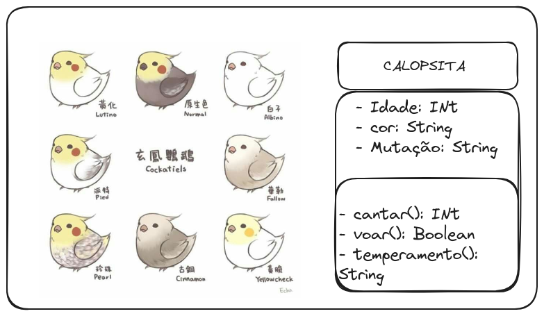
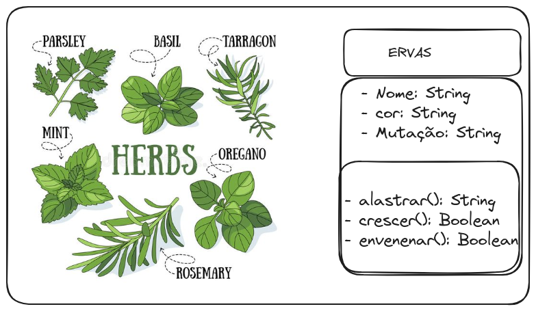
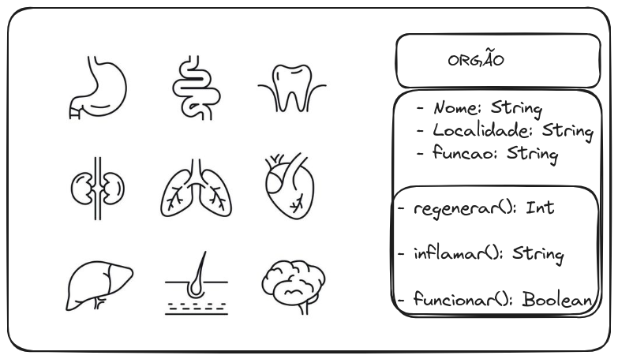
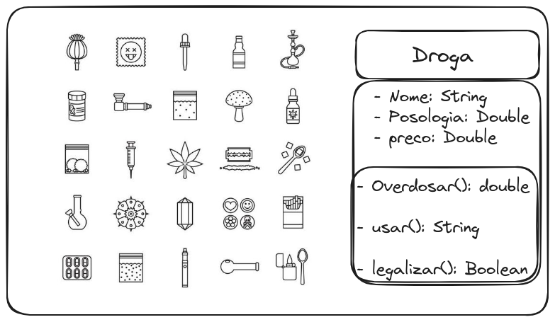
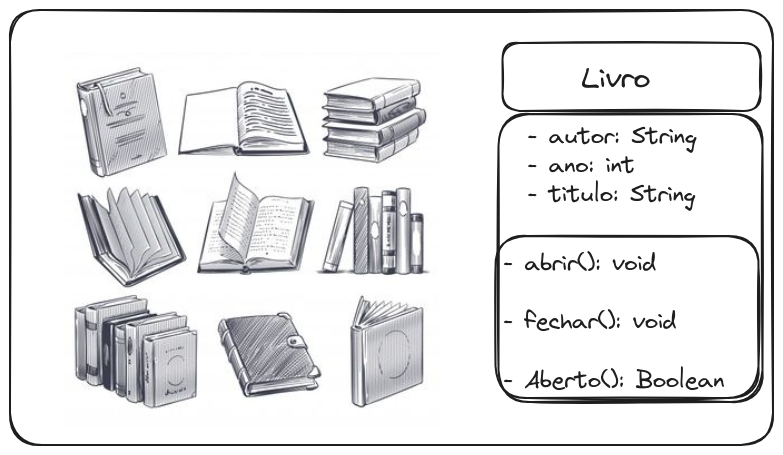
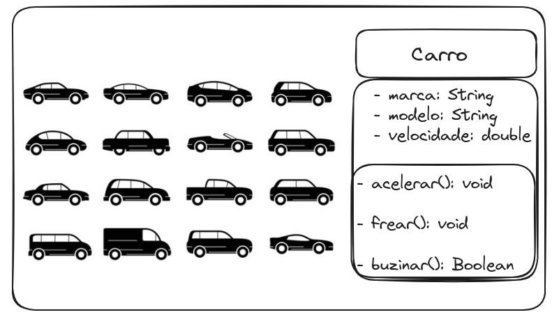
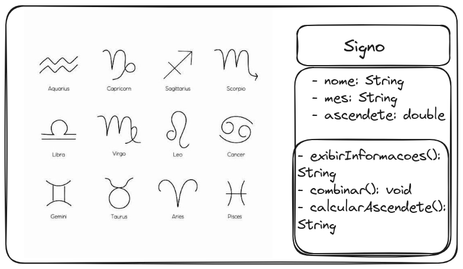
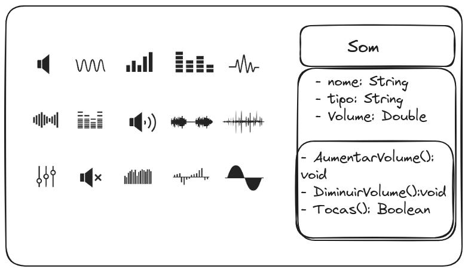
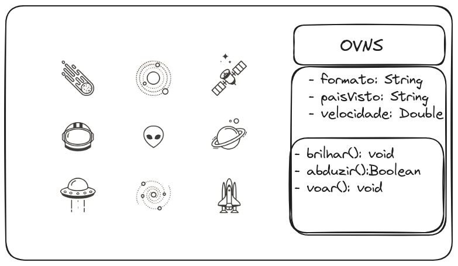

# Estudo sobre implementação de classes em Java

1. Colete 10 figuras contendo 2 ou mais objetos de uma mesma classe.
2. Modele na UML ou outra ferramenta cada classe, contando 3 métoso e 3 atributos.
3. Implemente cada classe

### Calopsitas (Classe: Calopsita)

### Ervas (Classe: ervas)

### Cogumelo (Classe: Cogumelo)

### Orgão (Classe: Orgão)

### Droga (Classe: Droga)

### Livro (Classe: Livro)

### Carro (Classe: Carro)

### Signo (Classe: Signo)

### Som (Classe: Som)

### Ovnis (Classe: Ovnis)

# Implementando Classes

Necessário implementar as classes dos diagramas de classes fornecido pela atividade 02 do Estudo de classe.

Serão implementado as classes droga, calopsita, órgão. 

## Testes de mesa

## Teste de Mesa - Classe img05droga.java

| Linha | Nome         | Posologia | Preço | legalizar | posologiaMultiplicada | retorno                         |
|-------|--------------|-----------|-------|-----------|-----------------------|--------------------------------|
| 4     | null         | null      | null  | null      | null                  | null                           |
| 5     | null         | null      | null  | null      | null                  | null                           |
| 6     | null         | null      | null  | null      | null                  | null                           |
| 7     | null         | null      | null  | null      | null                  | null                           |
| 9     | "Paracetamol"| 20.0      | 15.0  | True      | null                  | null                           |
| 10    | "Paracetamol"| 20.0      | null  | null      | null                  | null                           |
| 11    | "Paracetamol"| 20.0      | null  | null      | null                  | null                           |
| 12    | "Paracetamol"| 20.0      | 15.0  | null      | null                  | null                           |
| 13    | "Paracetamol"| 20.0      | 15.0  | True      | null                  | null                           |
| 17    | "Paracetamol"| 20.0      | 15.0  | True      | 60.0                  | null                           |
| 18    | "Paracetamol"| 60.0      | 15.0  | True      | 60.0                  | 60.0                           |
| 22    | "Paracetamol"| 60.0      | 15.0  | True      | null                  | "Você está usando Paracetamol" |
| 26    | "Paracetamol"| 60.0      | 15.0  | False     | null                  | null                           |
| 27    | "Paracetamol"| 60.0      | 15.0  | False     | null                  | False                          |

## Teste de mesa calopsita

| Linha | Idade | Cor    | mutacao  | retorno                           |
|-------|-------|--------|----------|-----------------------------------|
| 7     | 2     | null   | null     |  null                             |    
| 8     | 2     | Branca | null     |  null                             |      
| 9     | 2     | Branca | Albina   |  null                             |
| 14    | 2     | Branca | Albina   |  "A calopsita está cantando!"     |
| 19    | 2     | Branca | Albina   |  True                             |
| 24    | 2     | Branca | Albina   |  "Ração especial para Calopsitas" |

## Teste de mesa orgao

| Linha | Nome        | Localidade | funcao   | retorno                   |
|-------|-------------|------------|----------|---------------------------|
| 7     | "Coração"   | null       | null     | null                      |
| 8     | "Coração"   | "peito"    | null     | null                      |
| 9     | "Coração"   | "peito"    |"Sofrer"  | null                      |
| 13    | "Coração"   | "peito"    |"Sofrer"  | 3                         |
| 19    | "Coração"   | "peito"    |"Sofrer"  | "Você está sofrendo"      |
| 22    | "Coração"   | "peito"    |"Sofrer"  | True                      |