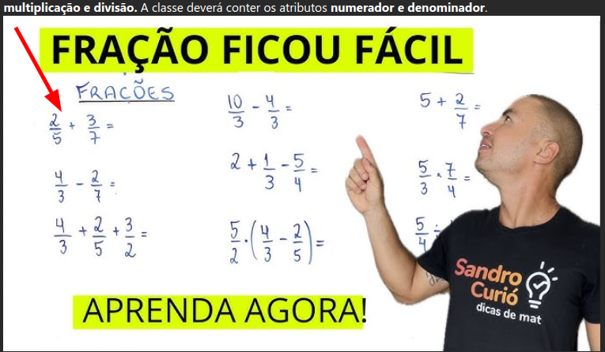
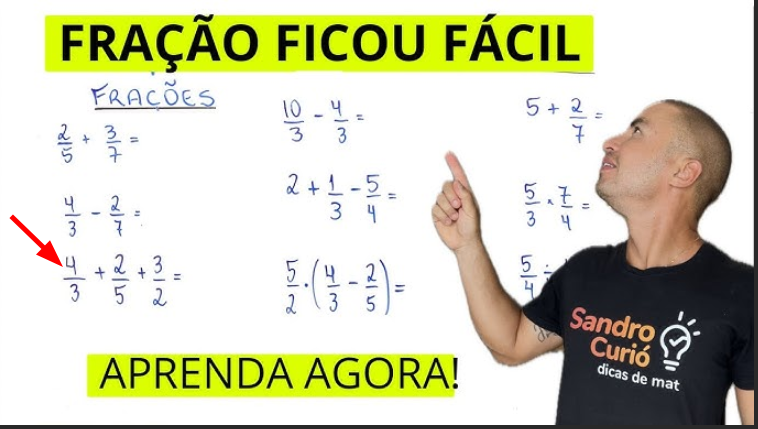
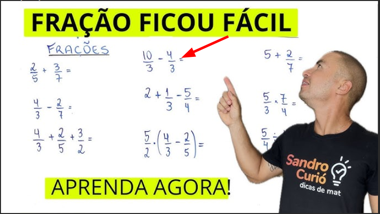
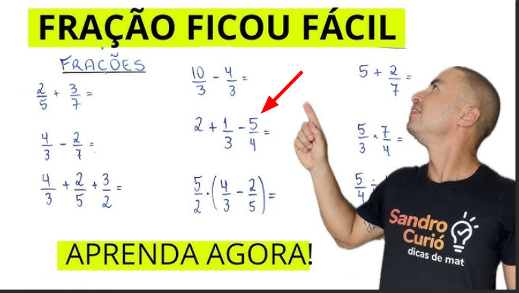
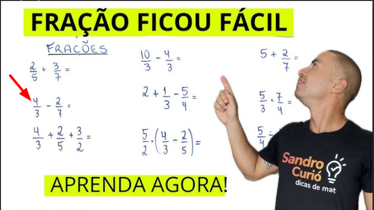

## Teste de mesa Calculo Soma 01 

| Variável                | Valor |
|-------------------------|-------|
| f1                      | 2/5   |
| f2                      | 3/7   |
| numerador               | 2     |
| denominador             | 5     |
| numeradorSegundoTermo   | 3     |
| denominadorSegundoTermo | 7     |
| numeradorResultante     | 29    |
| denominadorResultante   | 35    |
| resultado               | 29/35 |

## Teste de mesa Calculo Soma 02

| Variável                | Valor |
|-------------------------|-------|
| f1                      | 4/3   |
| f2                      | 2/5   |
| numerador               | 4     |
| denominador             | 3     |
| numeradorSegundoTermo   | 2     |
| denominadorSegundoTermo | 5     |
| numeradorResultante     | 26    |
| denominadorResultante   | 15    |
| resultado               | 26/15 |
| meio                    | 2     |
| f3                      | 26/15 |
| f2                      | 3/2   |
| numerador               | 26    |
| denominador             | 15    |
| numeradorSegundoTermo   | 3     |
| denominadorSegundoTermo | 2     |
| numeradorResultante     | 97    |
| denominadorResultante   | 30    |
| resultado               | 97/30 |

## Teste de mesa Calculo subtracao 03

| Variável                | Valor |
|-------------------------|-------|
| f1                      | 10/3  |
| f2                      | 4/3   |
| numerador               | 10    |
| denominador             | 3     |
| numeradorSegundoTermo   | 4     |
| denominadorSegundoTermo | 3     |
| mmc                     | 3     |
| numeradorResultante     | 26    |
| denominadorResultante   | 15    |
| resultado               | 6/13  |

## Teste de mesa Calculo adição e subtração 04

| Variável                | Valor |
|-------------------------|-------|
| f1                      | 2/1   |
| f2                      | 1/3   |
| numerador               | 2     |
| denominador             | 1     |
| numeradorSegundoTermo   | 1     |
| denominadorSegundoTermo | 3     |
| numeradorResultante     | 1     |
| denominadorResultante   | 3     |
| resultado               | 7/3   |
| meio                    | 1     |
| f3                      | 7/3   |
| f2                      | 5/4   |
| numerador               |  7    |
| denominador             |  3    |
| numeradorSegundoTermo   |  5    |
| denominadorSegundoTermo |  4    |
| mmc                     | 4     |
| mmc                     | 5     |
| mmc                     | 6     |
| mmc                     | 7     |
| mmc                     | 8     |
| mmc                     | 9     |
| mmc                     | 10    |
| mmc                     | 11    |
| mmc                     | 12    |
| resultado               | 13/12 |

## Teste de mesa Calculo subtração 05

| Variável                | Valor |
|-------------------------|-------|
| f1                      | 4/2   |
| f2                      | 2/7   |
| numerador               | 4     |
| denominador             | 2     |
| numeradorSegundoTermo   | 2     |
| denominadorSegundoTermo | 7     |
| mmc                     | 7     |
| mmc                     | 8     |
| mmc                     | 9     |
| mmc                     | 10    |
| mmc                     | 11    |
| mmc                     | 12    |
| mmc                     | 13    |
| mmc                     | 14    |
| mmc                     | 15    |
| mmc                     | 16    |
| mmc                     | 17    |
| mmc                     | 18    |
| mmc                     | 19    |
| mmc                     | 20    |
| mmc                     | 21    |
| numeradorResultante     | 22    |
| denominadorResultante   | 21    |
| resultado               | 22/21 |