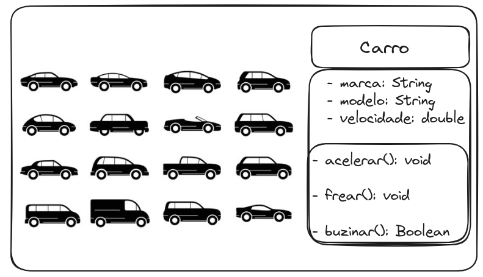

# Estudo sobre implementação de classes em Java

1. Colete 10 figuras contendo 2 ou mais objetos de uma mesma classe.
2. Modele na UML ou outra ferramenta cada classe, contando 3 métoso e 3 atributos.
3. Implemente cada classe

### Calopsitas (Classe: Calopsita)

### Ervas (Classe: ervas)

### Cogumelo (Classe: Cogumelo)

### Orgão (Classe: Orgão)

### Droga (Classe: Droga)

### Livro (Classe: Livro)

### Carro (Classe: Carro)

### Signo (Classe: Signo)

### Som (Classe: Som)

### Ovnis (Classe: Ovnis)

